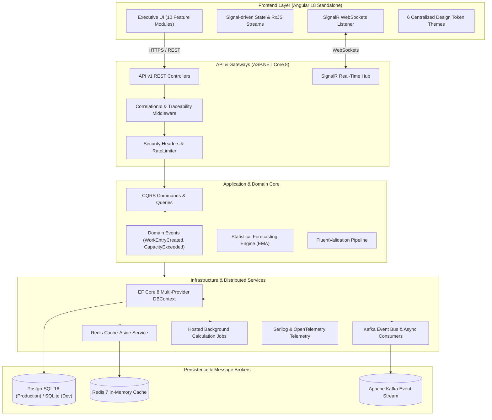

# ⚡ DWPTS — Daily Work Planning, Capacity Management & Observability Platform

[](https://github.com/palashmore/DWPTS/actions/workflows/backend-ci.yml)
[](https://github.com/palashmore/DWPTS/actions/workflows/frontend-ci.yml)
[](https://github.com/palashmore/DWPTS/actions/workflows/security.yml)
[](https://angular.dev)
[](https://dotnet.microsoft.com)
[](https://www.postgresql.org)
[](https://redis.io)
[](https://kafka.apache.org)
[](https://dotnet.microsoft.com)

**DWPTS (Daily Work Planning & Tracking System)** is an enterprise-grade operational workforce management, capacity forecasting, and observability suite designed for high-performance engineering organizations.

---

## 🌐 Live Production Deployments

- 🖥️ **Frontend SPA (Vercel Global Edge)**: [https://dwpts.vercel.app](https://dwpts.vercel.app)
- 🚀 **REST API Server (Render Cloud)**: [https://dwpts.onrender.com](https://dwpts.onrender.com)
- 📖 **Interactive OpenAPI / Swagger**: [https://dwpts.onrender.com/swagger/index.html](https://dwpts.onrender.com/swagger/index.html)
- 📦 **GitHub Source Repository**: [https://github.com/palashmore/DWPTS](https://github.com/palashmore/DWPTS)

---

## 🏛️ System Architecture

DWPTS adheres strictly to **Clean Architecture**, **Domain-Driven Design (DDD)**, and **CQRS**:



---

## 🌟 Key Technical Capabilities

### 1. 📈 Statistical Capacity & Workload Forecasting
- Multi-factor available capacity formulation:
  $$	ext{Available Capacity} = (	ext{Working Days} - 	ext{Holidays} - 	ext{Leaves}) 	imes 	ext{Daily Capacity Limit}$$
- **Exponential Moving Average (EMA)** workload forecasting engine predicting 30-day team utilization and overtime risk.

### 2. 🛡️ Multi-Tenant Privacy & RBAC Isolation
- Server-side **EF Core Global Query Filters** ensuring employees strictly view only self-logged tasks.
- Dedicated Admin employee switcher for organization-wide oversight.

### 3. ⚡ Distributed Caching & Event-Driven Architecture
- **Redis Distributed Cache** with cache-aside and automatic TTL for master taxonomy, holidays, and aggregates.
- **Kafka Event Streaming** publishing asynchronous domain events (`WorkEntryCreatedEvent`, `ExcelImportCompletedEvent`, `CapacityThresholdExceededEvent`).

### 4. 🔔 SignalR Real-Time Telemetry
- Real-time WebSocket notifications dispatched to connected clients upon task creation, capacity breach, or batch import completion.

### 5. 📡 API Monitoring & Observability Platform (`/monitoring`)
- Live backend health probe, roundtrip latency benchmark, database telemetry, and real-time request traffic trace.

---

## 🔑 Production Demo Credentials & RBAC Matrix

| Role | Username | Password | Access Scope |
| :--- | :--- | :--- | :--- |
| 🛡️ **ADMIN** | `admin` | `Admin@123` | **Full System Access**: User Directory (`/admin`), API Monitoring (`/monitoring`), Excel Importer (`/import`), Org-Wide Filters |
| 👔 **MANAGER** | `manager` | `Manager@123` | **Team Oversight**: Capacity Forecasts, Work Items Backlog, Master Data, Reports |
| 👨‍💻 **EMPLOYEE** | `employee` / `pallavi` / `sagar` | `Employee@123` (or set password) | **Strict Personal Work View**: Daily Work Planning, Monthly Calendar, Personal Reports |

---

## 🚀 Quickstart & Local Development

### 1. Run Everything with Docker Compose (1-Command Launch)
```bash
docker compose up -d
```
- Frontend UI: `http://localhost`
- Backend API: `http://localhost:5000` (Swagger: `http://localhost:5000/swagger`)
- PostgreSQL: `localhost:5432` | Redis: `localhost:6379` | Kafka: `localhost:9092`

### 2. Local Manual Run
```powershell
# Run Backend API (.NET 8)
cd src/DWPTS.Api
dotnet run

# Run Frontend Application (Angular 18)
cd client/dwpts-angular
npm install
npm start
```

### 3. Execute Automated Test Suite
```powershell
dotnet test
```

---

## 🎨 Enterprise Themes

DWPTS features 6 built-in luxury themes switchable via the **`🎨 Theme`** selector in the top navbar:
1. **Midnight Luxury** (Navy Deep & Champagne Gold)
2. **Royal Indigo** (Royal Indigo & Electric Violet)
3. **Executive Graphite** (Charcoal Carbon & Amber Gold)
4. **Ocean Luxe** (Abyss Blue & Luminous Cyan)
5. **Emerald Elite** (Forest Jade & Radiant Emerald)
6. **Platinum Light** (Crisp Canvas & Slate Gold)

---

## 📚 Technical Documentation

- 🏛️ [Architecture Specification](docs/architecture.md)
- 🔒 [Security & RBAC Specification](docs/SECURITY.md)
- 🗄️ [Database ERD & Schema](docs/DATABASE.md)
- 📡 [API Specification & Endpoints](docs/API.md)
- 📊 [Observability & Monitoring Guide](docs/OBSERVABILITY.md)
- 🚢 [Production Deployment Guide](docs/deployment-guide.md)

---

## 📄 License
Licensed under the [MIT License](LICENSE).
