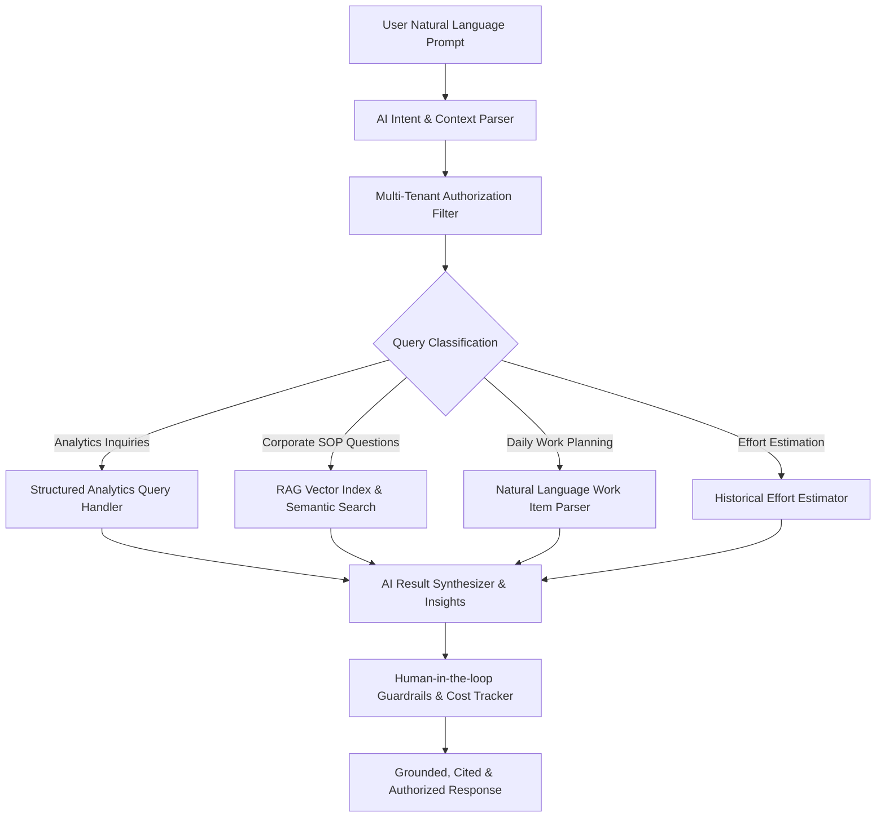

# 🧠 DWPTS AI Architecture & Intelligence Specification

## 1. High-Level AI Orchestration Pipeline
DWPTS integrates an enterprise AI intelligence layer with deterministic heuristic fallback, ensuring zero downtime even during third-party LLM outages.

## 2. Core AI Capabilities
1. **AI Daily Work Copilot (`/daily-work`)**:
   - Task prioritization based on deadline urgency, category impact (Bug Fix vs Development), and daily capacity limit.
   - Natural language work planner translating conversational text into structured draft entries.
2. **"Ask DWPTS" Natural Language Analytics (`/ai-assistant`)**:
   - Natural language queries (*"Who worked > 40h?"*, *"Analyze team utilization"*).
   - Translates into safe, validated analytical handlers with **zero direct SQL execution**.
3. **RAG Corporate Knowledge Base (`/knowledge`)**:
   - Corporate SOP repository with semantic similarity matching and **explicit source document citations**.
